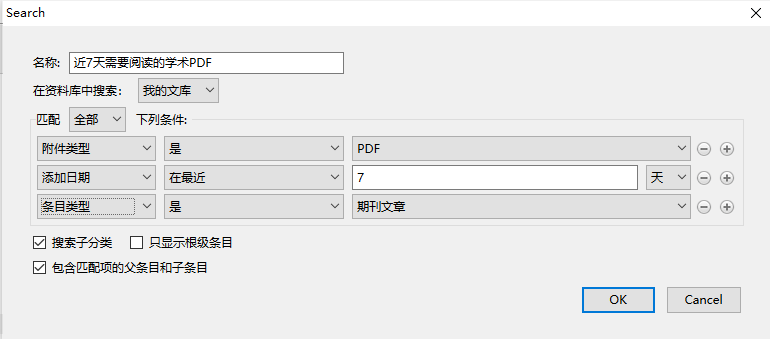

# zotero文献资料管理

## 应用场景

管理论文，分类和整理论文，收藏图书信息(建立自己的书库),收藏github仓库并建立索引，以及各种资料收集整理。

## 与Evernote的区别

印象笔记主要是用于剪藏网页，记录笔记等，而zotero更偏重论文，信息索引等信息整理部分，当然你也可以对信息做笔记，但侧重点在信息索引。

## 安装

http://www.zotero.org/download/
（注：浏览器插件也要安装）

## 导入文献方式

互联网自动识别：Web Translators (URL bar icon)
手动输入：Manual Input or Edit From a bibliographic
文件导入：format (RIS, BibTeX, MARC, etc.)
通过标示符增加：Add by identifier (DOI, ISBN, PMID)
通过PDF元数据识别：Add PDF then Retrieve Metadata
从网页识别：Get any Webpage with basic data

记录几个比较实用的。

### 互联网自动识别

比如你要把深度学习这本书作为加入收藏，那就进入[豆瓣书籍页面](https://book.douban.com/subject/27087503)，打开后右上角zotero插件就会变成书的样子，点击即可保存

### 通过标示符增加

这里可以通过手动输入ISBN，DOI等信息直接导入：

### 导入Google学术

在谷歌学术中搜索你想找的领域，然后就可以通过插件直接批量导入了：

### 导入arxiv

对于我们搞计算机的，arxiv上的论文还是看的不少的，可以直接打开arxiv链接，通过插件直接save。保存后会看到相应的快照甚至是对应的pdf也已经在里面了，非常方便：

### 导入pdf

如果之前已经下载了些pdf，可直接拖进zotero，然后右键选择解析metadata就可以了。（一般可自动完成，没有的话可以手动）

## 插件

- zotfile: pdf文件操作
- markdown here： markdown笔记
- ZoteroQuickLook: 可快速预览文件内容

## 数据同步

这里推荐直接通过百度云，坚果云之类的国内解决方案，我是通过百度云直接将**storage**文件夹进行同步：

这里文件目录是我自定义的，可以在编辑->首选项->高级下的数据存储位置处修改：

## 自定义搜索

我们可以构造自己的条件来进行文献搜索，比如我想将近7天的论文建立一个索引，每天都可以查看最近七天加入的论文，可以在我的文库右键选择新建搜索，并添加以下条件即可：

## 参考
[豆瓣小组-Zotero入门六篇](https://www.douban.com/group/topic/45562674/)